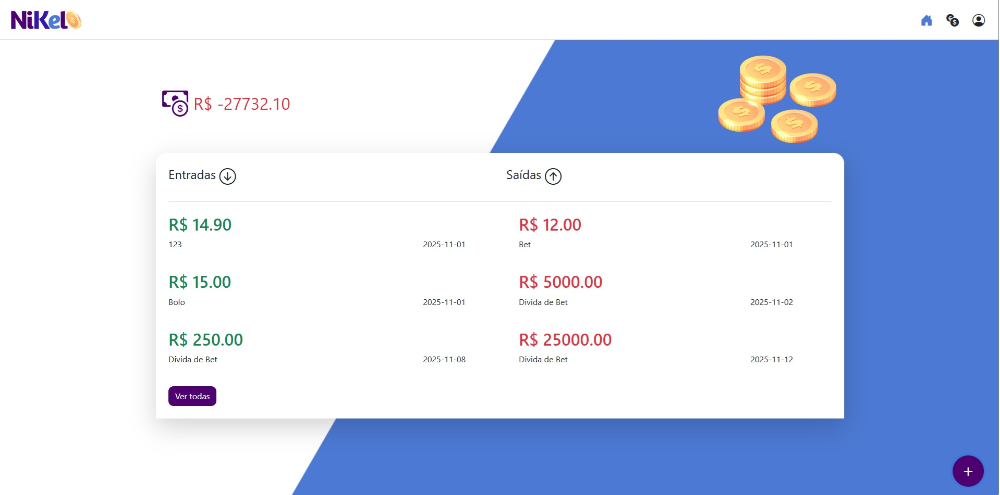

# 💰 Nikel – Gerenciador de Finanças Pessoais

Aplicação web simples e intuitiva para controle de entradas, saídas e saldo total, desenvolvida com **HTML**, **CSS**, **JavaScript** e **Bootstrap** como parte da formação Codaí 2.0 - Front-End.  
Os dados são armazenados localmente no navegador, permitindo o uso offline.

---

## 🚀 Funcionalidades Principais

- **Cadastro e login de usuário**
  - Criação de conta com validação de e-mail e senha segura (mín. 8 caracteres, letra maiúscula, número e símbolo).
  - Opção de “manter sessão ativa”.
- **Controle financeiro**
  - Registro de **entradas** e **saídas** com valor, descrição e data.
  - Cálculo automático do saldo total.
  - Visualização de últimas movimentações na tela inicial e histórico completo na aba de lançamentos.
- **Interface responsiva**
  - Layout moderno e limpo, com tema em tons de roxo e azul.
  - Ícones do Bootstrap e modais dinâmicos para cadastro e lançamentos.
- **Persistência local**
  - Todos os dados são armazenados via **LocalStorage** e **SessionStorage**.

---

## 🧱 Estrutura do Projeto

```
📂 Nikel
├── index.html              # Tela de login e criação de conta
├── home.html               # Tela inicial com resumo financeiro
├── transactions.html       # Tela com histórico completo de lançamentos
│
├── js/
│   ├── index.js            # Lógica de login e cadastro
│   ├── home.js             # Lógica da tela principal e saldo total
│   └── transactions.js     # Listagem detalhada de lançamentos
│
├── css/
│   └── styles.css          # Estilos e identidade visual
│
└── assets/
    └── images/             # Logos e ícones do app
```

---

## 🛠️ Tecnologias Utilizadas

- **HTML5**
- **CSS3**
- **JavaScript (ES6)**
- **Bootstrap 5**
- **Bootstrap Icons**
- **LocalStorage / SessionStorage**

---

## 💡 Fluxo do Usuário

1. O usuário acessa `index.html` e pode:
   - Fazer login (armazenado na sessão ou localmente).
   - Criar nova conta com e-mail e senha validados.
2. Após o login, é redirecionado para `home.html`, onde:
   - Visualiza saldo total e últimas movimentações.
   - Pode adicionar novos lançamentos via modal.
3. O botão “Ver todas” leva à `transactions.html`, com a listagem completa das transações salvas.

---

## 📸 Capturas de Tela (sugestão)

- **Tela de Login e Criação de Conta**
> 
> 
- **Tela Inicial (Entradas/Saídas/Saldo) e adição de movimentações**
> 
> 
- **Histórico Completo de Lançamentos**
> 


---

## 🧹 Boas Práticas

- Commits padronizados e descritivos com emojis:
  - ✨ nova funcionalidade  
  - 🐛 correção de bug  
  - 🎨 melhoria de layout  
  - 💾 ajustes de persistência  

---

## ⚙️ Como Executar Localmente

1. Clone o repositório:
   ```bash
   git clone https://github.com/seu-usuario/nikel.git
   ```
2. Abra o projeto no **VS Code**.
3. Clique com o botão direito em `index.html` → **Open with Live Server**.
4. Crie uma conta e comece a gerenciar suas finanças.

---

## 🧑‍💻 Autor

**Jaime Fernandes**  
💼 Desenvolvedor Full Stack  
📧  | [GitHub](https://github.com/jfan-dev)
